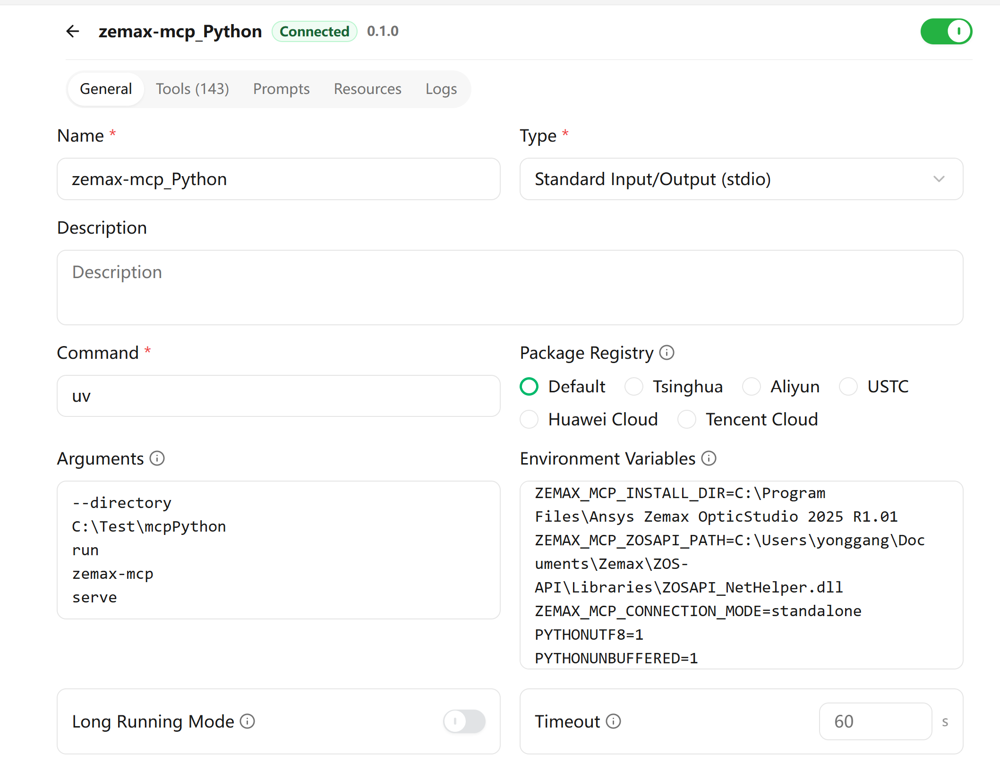

# zemax-mcp

A Windows-only [Model Context Protocol (MCP)](https://modelcontextprotocol.io/) server for automating Ansys Zemax OpticStudio through ZOS-API.

`zemax-mcp` exposes sequential, non-sequential, analysis, optimization, glass, tolerancing, configuration, and lifecycle operations to MCP clients such as Cherry Studio, Claude Desktop, Claude Code, and other clients that can launch a local stdio server.

> **Project status: alpha and offline-first.** Public schemas, catalog coverage, import safety, and fake-backend behavior are tested without OpticStudio. A registered tool is not necessarily live-verified against ZOS-API; consult the capability status before relying on it in production.

## Contents

- [Current MCP surface](#current-mcp-surface)
- [Prerequisites](#prerequisites)
- [Download from GitHub](#download-from-github)
- [Install and validate](#install-and-validate)
- [Run the server](#run-the-server)
- [Configure MCP clients](#configure-mcp-clients)
- [Runtime configuration](#runtime-configuration)
- [Testing and development](#testing-and-development)
- [Security and proprietary files](#security-and-proprietary-files)

## What this project does

The package separates the public JSON/MCP surface from the proprietary .NET runtime. Source inspection, packaging, CI, catalog generation, and offline tests therefore remain redistributable and runnable without Ansys software. Live optical operations load Python.NET and the locally installed ZOS-API assemblies only when needed.

The public interface is maintained in the checked-in tool registry and capability manifest. Each tool has an explicit implementation and evidence status so users can distinguish live-verified behavior from offline-tested or scaffolded functionality.

## Current MCP surface

The source-derived catalog currently contains:

| Surface or status | Count |
| --- | ---: |
| Registered tools | **143** |
| MCP resources | **3** |
| MCP prompts | **3** |
| Production handlers | **131** |
| Live-verified tools | **34** |
| Offline-implemented tools | **97** |
| Scaffolded tools | **11** |
| Unsupported tools | **1** |

The 131 production handlers consist of 34 tools with recorded live evidence and 97 tools implemented and tested offline. The intentionally unsupported tool is `zemax_eval`.

Capability statuses mean:

- `live-verified`: exercised successfully against a documented OpticStudio/API environment.
- `offline-implemented`: implemented and tested with fakes or offline tests, but not proven against a live ZOS-API environment.
- `scaffolded`: its public name and contract are cataloged, but execution is not implemented.
- `unsupported`: intentionally unavailable, with the reason recorded in the catalog.

The server also provides these resources:

- `zemax://catalog/manifest`
- `zemax://catalog/capabilities`
- `zemax://session/status`

And these workflow prompts:

- `zemax_analyze_system`
- `zemax_optimize_system`
- `zemax_build_nsc_system`

Inspect the source-of-truth report with:

```powershell
uv run zemax-mcp manifest
uv run zemax-mcp report --check
```

See [Tool coverage](docs/tool-coverage.md), [`tool-coverage.json`](tool-coverage.json), and the curated [live test report](live-test-report.md).

## Prerequisites

### Offline installation, development, and CI

- Windows 10 or Windows 11, 64-bit.
- CPython 3.11 or 3.12, 64-bit.
- [`uv`](https://docs.astral.sh/uv/).
- A compatible .NET runtime for Python.NET, normally the Windows .NET Framework runtime available on supported OpticStudio workstations.
- Git, if cloning the repository instead of downloading a ZIP archive.

Confirm that the commands are available:

```powershell
python --version
git --version
uv --version
```

### Live OpticStudio use

Live operations additionally require:

- A locally installed, ZOS-API-capable version of Ansys Zemax OpticStudio.
- A valid OpticStudio/API license and an available license seat.
- Access to the ZOS-API assemblies installed with OpticStudio.
- For Interactive Extension mode, a running OpticStudio instance configured to accept the extension connection.
- Permission under your Ansys license and organizational policy to perform the requested automation.

This package does not include, grant, emulate, or bypass OpticStudio or ZOS-API licensing.

## Download from GitHub

The GitHub repository is:

<https://github.com/YonggangG/Zemax_MCP_Server>

### Option 1: Clone with Git

```powershell
git clone https://github.com/YonggangG/Zemax_MCP_Server.git
cd Zemax_MCP_Server
```

To update an existing clone later:

```powershell
git pull --ff-only
uv sync --frozen
```

### Option 2: Download the source ZIP

Download the current `main` branch from:

<https://github.com/YonggangG/Zemax_MCP_Server/archive/refs/heads/main.zip>

Extract the ZIP, open PowerShell in the extracted directory, and follow the installation instructions below.

### Option 3: Use a GitHub Release

Audited wheels and source archives may be attached to:

<https://github.com/YonggangG/Zemax_MCP_Server/releases>

The repository source is the normal choice for development and for the checked-in MCP client examples. The `dist/` folder is generated build output and is **not** the GitHub source repository. Do not upload an old local `dist/` blindly; rebuild and inspect release artifacts before publishing them.

## Install and validate

### Minimal runtime installation from a checkout

From the repository root:

```powershell
uv sync --frozen
uv run zemax-mcp version
uv run zemax-mcp doctor
uv run zemax-mcp report --check
```

Start the default stdio server with:

```powershell
uv run zemax-mcp serve
```

The server waits for an MCP client on standard input/output. It may appear idle when started directly in a terminal; that is normal.

### Development installation

Install all optional and development dependencies:

```powershell
uv sync --frozen --all-extras --dev
```

### Optional direct executable

After `uv sync`, the checkout contains a console executable at:

```text
C:\path\to\Zemax_MCP_Server\.venv\Scripts\zemax-mcp.exe
```

This absolute executable path is useful when a GUI client cannot find `uv` through its inherited `PATH`. Validate it with:

```powershell
.\.venv\Scripts\zemax-mcp.exe version
.\.venv\Scripts\zemax-mcp.exe doctor
```

### What `doctor` checks

`zemax-mcp doctor` checks the Python version, installed MCP SDK, expected MCP SDK API import, non-empty tool catalog, CLR-free session import, and host platform information.

It does **not** prove that:

- ZOS-API assemblies can be loaded;
- an OpticStudio license is available;
- standalone or Interactive Extension connection succeeds;
- a particular lens can be opened or modified;
- every registered tool works in the installed OpticStudio version.

For an actual live connectivity test, start the server from an MCP client and call `zemax_connect`.

## Run the server

### CLI commands

```powershell
uv run zemax-mcp version
uv run zemax-mcp doctor
uv run zemax-mcp doctor --json
uv run zemax-mcp manifest
uv run zemax-mcp manifest --compact
uv run zemax-mcp report
uv run zemax-mcp report --check
uv run zemax-mcp serve
```

Calling `zemax-mcp` without a subcommand also starts the stdio server.

### Transports

| Transport | Example | Intended use |
| --- | --- | --- |
| stdio | `uv run zemax-mcp serve` | Default and recommended for Cherry Studio, Claude Desktop, and Claude Code. |
| SSE | `uv run zemax-mcp serve --transport sse --host 127.0.0.1 --port 8000` | Local clients that specifically require the legacy SSE transport. |
| Streamable HTTP | `uv run zemax-mcp serve --transport streamable-http --host 127.0.0.1 --port 8000` | Local HTTP MCP clients. |

The checked-in client examples use stdio. SSE and Streamable HTTP are supported by CLI routing but are not the primary live-evidence transport. They do not add authentication or TLS; keep them bound to `127.0.0.1` unless a reviewed gateway supplies access control, encryption, and auditing.

## Configure MCP clients

Use absolute Windows paths. For stdio, MCP JSON-RPC owns standard input/output; diagnostics must not be inserted into stdout. Avoid wrapping the server in PowerShell, `cmd /c`, or a pipeline unless the client specifically requires a shell.

Ready-to-edit templates are in [`examples/`](examples/):

- [`examples/cherry-studio.json`](examples/cherry-studio.json)
- [`examples/claude-desktop.json`](examples/claude-desktop.json)
- [`examples/claude-code.mcp.json`](examples/claude-code.mcp.json)
- [`examples/extension-env.json`](examples/extension-env.json)

### Cherry Studio

In **Settings → MCP Servers**, add a local command/stdio server:

- **Name:** `zemax`
- **Type/transport:** `stdio` or local command
- **Command:** `uv`
- **Arguments:** `--directory`, `C:\path\to\Zemax_MCP_Server`, `run`, `zemax-mcp`, `serve`
- **Environment:** at minimum, choose the intended connection mode

Equivalent JSON-shaped configuration:

```json
{
  "name": "zemax",
  "type": "stdio",
  "command": "uv",
  "args": [
    "--directory",
    "C:\\path\\to\\Zemax_MCP_Server",
    "run",
    "zemax-mcp",
    "serve"
  ],
  "env": {
    "ZEMAX_MCP_CONNECTION_MODE": "standalone"
  }
}
```

If Cherry Studio cannot resolve `uv`, use the checkout executable instead:

```json
{
  "name": "zemax",
  "type": "stdio",
  "command": "C:\\path\\to\\Zemax_MCP_Server\\.venv\\Scripts\\zemax-mcp.exe",
  "args": ["serve"],
  "env": {
    "ZEMAX_MCP_CONNECTION_MODE": "standalone"
  }
}
```

#### Cherry Studio settings example

The screenshot below shows a connected local stdio configuration. Replace the project, OpticStudio, and ZOS-API paths with locations on your own Windows workstation.



Save the entry, enable it, and review the server log if the connection indicator does not become ready.

### Claude Desktop

On Windows, edit the per-user configuration file, normally:

```text
%APPDATA%\Claude\claude_desktop_config.json
```

Add the server under `mcpServers`:

```json
{
  "mcpServers": {
    "zemax": {
      "command": "uv",
      "args": [
        "--directory",
        "C:\\path\\to\\Zemax_MCP_Server",
        "run",
        "zemax-mcp",
        "serve"
      ],
      "env": {
        "ZEMAX_MCP_CONNECTION_MODE": "standalone"
      }
    }
  }
}
```

Alternatively, set `command` to the absolute `.venv\Scripts\zemax-mcp.exe` path and set `args` to `["serve"]`.

Restart Claude Desktop completely after changing the configuration. If `uv` works in PowerShell but not in Claude Desktop, use `where.exe uv` and place the returned absolute `uv.exe` path in `command`, or use the direct executable pattern above.

### Claude Code

Register the checkout as a local stdio server:

```powershell
claude mcp add --transport stdio zemax -- uv --directory C:\path\to\Zemax_MCP_Server run zemax-mcp serve
claude mcp list
```

Or register the direct executable:

```powershell
claude mcp add --transport stdio zemax -- C:\path\to\Zemax_MCP_Server\.venv\Scripts\zemax-mcp.exe serve
claude mcp list
```

For a project-shared `.mcp.json`, start with [`examples/claude-code.mcp.json`](examples/claude-code.mcp.json). Do not commit user-specific absolute paths, license information, customer paths, or secrets.

### Other stdio MCP clients

Use one of these equivalent launch patterns:

```text
uv --directory C:\path\to\Zemax_MCP_Server run zemax-mcp serve
```

or:

```text
C:\path\to\Zemax_MCP_Server\.venv\Scripts\zemax-mcp.exe serve
```

Map the command, argument list, and environment variables into the client’s local-process/stdio MCP configuration format.

## Runtime configuration

Environment variables are the stable way to configure desktop stdio clients:

| Variable | Meaning | Default |
| --- | --- | --- |
| `ZEMAX_MCP_INSTALL_DIR` | OpticStudio installation root | auto-discover |
| `ZEMAX_MCP_ZOSAPI_PATH` | ZOS-API directory or full path to `ZOSAPI.dll` | auto-discover |
| `ZEMAX_MCP_CONNECTION_MODE` | `standalone` or `extension` | `standalone` |
| `ZEMAX_MCP_INSTANCE_ID` | Interactive Extension instance ID | `0` |
| `ZEMAX_MCP_WORKER_NAME` | Internal serialized ZOS worker name | `zemax-zos-worker` |
| `ZEMAX_MCP_GLASSCAT_DIR` | Explicit Glasscat search root(s), separated by the Windows path separator | unset |
| `ZEMAX_MCP_ZEMAX_ROOT` | Zemax root whose `Glasscat` subdirectory should be searched | unset |
| `ZEMAX_MCP_ALLOW_DESTRUCTIVE` | Must be `1` in addition to explicit tool confirmation for destructive Design Lockdown | unset |

Discovery checks explicit configuration first, followed by common Windows registry entries and known Program Files locations. If discovery fails, set `ZEMAX_MCP_ZOSAPI_PATH` explicitly.

### Standalone versus Interactive Extension

| Mode | Behavior | Recommended use |
| --- | --- | --- |
| `standalone` | Starts and owns a headless OpticStudio application through ZOS-API. The server may close the application it created. | Reproducible automation jobs and isolated MCP sessions. |
| `extension` | Borrows a user-started OpticStudio application through Interactive Extension. The server must not close the borrowed application by default. | Inspecting or modifying a system already open in the OpticStudio UI. |

For extension mode, enable Interactive Extension in OpticStudio before the MCP server connects, then use:

```json
{
  "ZEMAX_MCP_CONNECTION_MODE": "extension",
  "ZEMAX_MCP_INSTANCE_ID": "0"
}
```

Instance IDs are installation/session specific. `0` selects the first or default available instance.

## Architecture

```text
MCP transport / CLI
        |
Tool registry + source-derived manifest
        |
Pydantic contracts and service layer
        |
Process-wide serialized ZOS executor
        |
ZOS backend protocol
     /       \
Fake backend   Python.NET + local ZOS-API assemblies
```

Key design rules:

- Public modules and catalog inspection remain importable without loading OpticStudio or initializing Python.NET.
- Proprietary assembly loading occurs only in the dedicated ZOS execution path.
- ZOS-API calls are serialized because automation objects are stateful and thread-sensitive.
- Standalone applications are owned; Interactive Extension applications are borrowed.
- Handles prevent raw .NET objects from leaking into JSON/MCP contracts.
- Fake backends support deterministic offline contract and lifecycle tests.

See [Architecture](docs/architecture.md).

## Testing and development

Run the public offline checks from the repository root:

```powershell
uv sync --frozen --all-extras --dev
uv run zemax-mcp report --check
uv run ruff format --check .
uv run ruff check .
uv run mypy src tests
uv run pytest -m "not live_zemax" --cov=zemax_mcp --cov-report=term-missing --cov-report=xml
uv build
uv run python scripts/verify_dist_contents.py dist
```

Live tests require both the marker and an explicit opt-in on a licensed workstation; they never run in public CI:

```powershell
$env:ZEMAX_MCP_LIVE = '1'
uv run pytest -m live_zemax
```

Review live tests before running them. They may launch OpticStudio, consume a license seat, create output, or modify the active disposable system. See [Testing](docs/testing.md).

## Security and proprietary files

This server can open, modify, optimize, and save optical systems. Treat MCP access as local automation authority over the connected OpticStudio environment. Do not enable the server for untrusted users or prompts without suitable process, filesystem, network, and client controls.

This repository and its Python distributions do **not** include or redistribute ZOS-API DLLs, OpticStudio executables, glass catalogs, sample lens files, license material, or other Ansys/Zemax assets. At runtime the package discovers assemblies from the user’s licensed local installation.

Do not copy proprietary files into the repository, wheels, source archives, CI artifacts, examples, or bug reports. See [SECURITY.md](SECURITY.md) and [THIRD_PARTY_NOTICES.md](THIRD_PARTY_NOTICES.md).

## Troubleshooting

Start with:

```powershell
uv run zemax-mcp doctor
uv run zemax-mcp doctor --json
uv run zemax-mcp report --check
```

See [Troubleshooting](docs/troubleshooting.md) for `uv` path resolution, missing assemblies, Python/.NET bitness mismatches, unavailable licenses, Interactive Extension setup, stdio contamination, and stale client processes.

## Roadmap

See [Roadmap](docs/roadmap.md). Registration and offline implementation are not substitutes for expanding repeatable live-verification coverage across supported OpticStudio versions and connection modes.

## License

MIT. See [LICENSE](LICENSE).

Ansys, Zemax, OpticStudio, ZOS-API, Claude, and Cherry Studio are trademarks or products of their respective owners. This project is not endorsed by or affiliated with those vendors unless explicitly stated.
